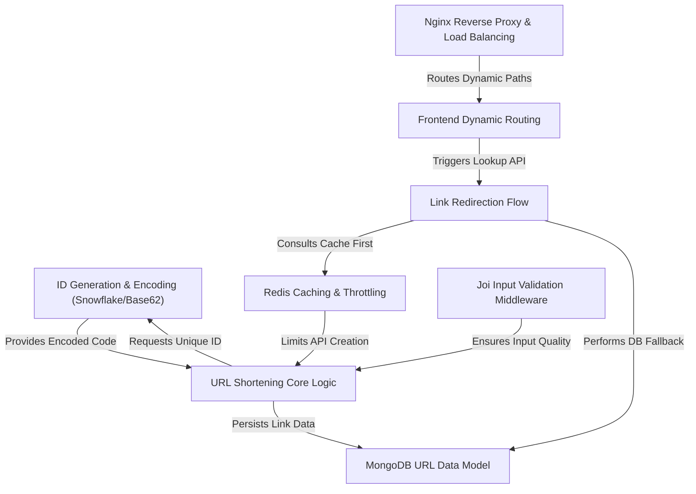

ZipLink is a highly scalable, distributed URL shortener built for speed and reliability. It uses a **Snowflake** system to generate unique, time-sortable short codes, which are stored persistently in *MongoDB*. Requests are managed by **Nginx**, which directs traffic to a distributed backend protected by *Redis* rate limiting. The system resolves short links quickly by checking the Redis cache first, falling back to the database only when necessary, and handles advanced features like password protection and link expiration.

```mermaid
flowchart TD
    A0["ID Generation & Encoding (Snowflake/Base62)
"]
    A1["URL Shortening Core Logic
"]
    A2["Nginx Reverse Proxy & Load Balancing
"]
    A3["Link Redirection Flow
"]
    A4["MongoDB URL Data Model
"]
    A5["Redis Caching & Throttling
"]
    A6["Frontend Dynamic Routing
"]
    A7["Joi Input Validation Middleware
"]
    A2 -- "Routes Dynamic Paths" --> A6
    A6 -- "Triggers Lookup API" --> A3
    A7 -- "Ensures Input Quality" --> A1
    A1 -- "Requests Unique ID" --> A0
    A0 -- "Provides Encoded Code" --> A1
    A1 -- "Persists Link Data" --> A4
    A5 -- "Limits API Creation" --> A1
    A3 -- "Consults Cache First" --> A5
    A3 -- "Performs DB Fallback" --> A4
```
